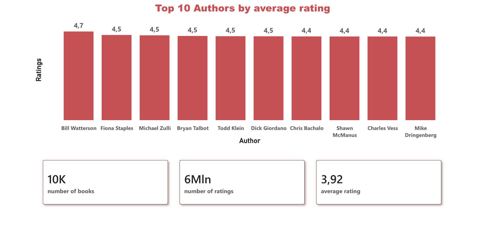
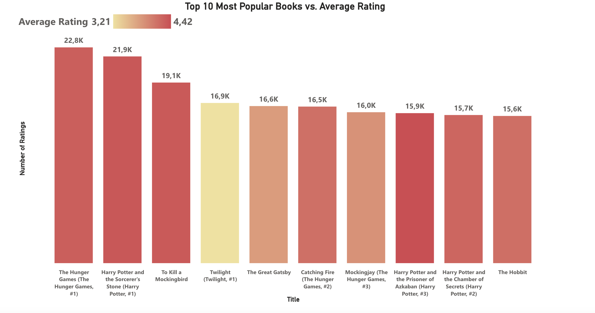

# Goodreads Data Warehouse: PostgreSQL & DuckDB

An end-to-end data engineering project: from raw CSV files to an analytical star schema, featuring a dual-engine architecture (PostgreSQL & DuckDB) and a Power BI dashboard.

##  How to Run the ETL Pipelines (Execution Guide)

To ensure full reproducibility and idempotency, this repository features two separate implementations (**DuckDB** and **PostgreSQL**). 

### Prerequisites
1. **Clone the repository** to your local machine.
2. **Download the Dataset:** Place the original CSV files (`books.csv`, `ratings.csv`, `book_tags.csv`, `tags.csv`, `to_read.csv`) inside a folder named `data/` at the root of the project.
3. **Install an SQL Client:** Download [DBeaver](https://dbeaver.io/) (Community Edition) to execute the scripts.

---
### 🔍 The Data Exploration Phase (EDA)
You will notice unnumbered exploration scripts in both folders (`goodreads_duckdb_exploration.sql` and `goodreads_query_exploration.sql`). 

These scripts are not strictly part of the automated ETL pipeline. Instead, they were designed to be run **after the initial data ingestion and before the transformation phase**. They document the Data Quality assessment (e.g., finding NULLs, handling scientific notation in ISBNs, identifying duplicates) that provided the necessary awareness of the raw data to build the subsequent `transformation` logic.

### Option A: DuckDB Pipeline (Analytical Engine)

To run the high-speed local OLAP pipeline in DBeaver using DuckDB, execute the scripts in **strict numerical order**. The script about exploration will function only for the raw data. This sequence guarantees idempotency (building raw tables, cleaning anomalies, and generating the Kimball star schema):

1. `01_paths_from_local_to_duckdb.sql` — Ingests raw data via relative paths.
2. `02_goodreads_duckdb_transformation.sql` — Cleans data types (e.g., ISBN formatting) and handles missing values/duplicates.
3. `03_goodreads_bridges_dimensions_facts_duckdb.sql` — Generates surrogate keys and builds the final dimensional star schema.

---

### Option B: PostgreSQL Pipeline (Relational Backend)
To run the traditional relational pipeline in PostgreSQL:

1. Connect to your PostgreSQL instance via DBeaver. *(Note: For this project, the production PostgreSQL database was hosted on **Microsoft Azure** to facilitate seamless cloud integration with Power BI, but the scripts run perfectly on any local PostgreSQL instance).*
2. Execute the scripts in numerical order (similar to the DuckDB workflow) to set up the DDL, ingest raw tables, clean data, and construct the final normalized data warehouse used to feed the Power BI dashboard.

##  Why This Project?
As an aspiring data engineer, I built this project to demonstrate my ability to:
* Explore and assess raw, messy data.
* Design an idempotent ETL pipeline using SQL.
* Model a Kimball-style star schema with many-to-many relationships.
* Handle real-world data quality issues (scientific notation, missing values, duplicates).
* **Compare a traditional relational engine (PostgreSQL) with a modern columnar OLAP engine (DuckDB) for high-speed analytical queries.**
* Deploy a cloud-based database architecture (Azure) to support BI tools.
* Create a clean, well-documented repository suitable for a professional portfolio.

This project mimics the typical workflow in a data team: import CSVs, clean anomalies, normalize entities, and deliver a ready-to-query dimensional model.

##  Dataset
Source: [goodbooks-10k on GitHub](https://github.com/zygmuntz/goodbooks-10k). A dataset of 10,000 books, 6M+ ratings, tags, and to-read lists from Goodreads.

## Original tables:
- `books.csv`
- `ratings.csv`
- `book_tags.csv`
- `tags.csv`
- `to_read.csv`

##  Architecture & Dual Pipeline
To highlight different Data Engineering techniques, the repository is split into two implementations:

### 1. PostgreSQL Pipeline (The Cloud BI Backend)
Used as the robust backend for Data Visualization, deployed on **Microsoft Azure** to provide a scalable cloud database.
* **Integration:** Natively connected to **Power BI** via the Azure Database for PostgreSQL connector to power the final dashboard.
* **Methodology:** Standard relational DDL, manual `COPY` ingestion, and traditional CTEs for data cleaning.

### 2. DuckDB Pipeline (The Analytical Engine)
Built to demonstrate blazing-fast local OLAP analytics, processing 6M+ rows in seconds via DBeaver.
* **Exploration:** Advanced EDA, anomaly detection, and array unnesting (documented in `goodreads_duckdb_exploration.sql`).
* **Ingestion & Transformation:** Ingests raw CSVs using relative paths (`01_paths_from_local_to_duckdb.sql`) and leverages DuckDB's `QUALIFY` clause for elegant deduplication (`02_goodreads_duckdb_transformation.sql`).
* **Star Schema:** Generates surrogate keys on the fly using Window Functions, building an idempotent Kimball model with explicit Primary and Foreign Keys (`03_goodreads_bridges_dimensions_facts_duckdb.sql`).

##  Technologies
* **Cloud & Databases:** Microsoft Azure, PostgreSQL, DuckDB
* **Languages:** SQL
* **Tools:** DBeaver, Power BI, Git

##  Key Design Decisions
* **Idempotency:** All scripts use `DROP TABLE IF EXISTS` + `CREATE TABLE ... INSERT` (or CTAS) to guarantee reproducible results on multiple runs.
* **ISBN13 Cleaning:** Scientific notation (e.g., '9.78E+12') is converted back to 13-digit strings with zero-padding using Regex.
* **Missing Values:** Assigned `'unknown'` for text fields, `-1` for missing publication years.
* **Duplicate Handling:** Resolved via Window Functions (`ROW_NUMBER()`) keeping the most relevant row (e.g., highest rating).
* **Many-to-Many Relationships:** Resolved via bridge tables (book–authors, book–tags) to avoid inflating fact table aggregations.
* **Two Fact Tables:** Segregated events into `fact_ratings` (transactional, measurable) and `fact_to_read` (factless, tracking state/intent).

## 📊 Data Visualization & Business Insights (Power BI)

To complete the end-to-end data pipeline, I connected Power BI directly to the **Azure-hosted PostgreSQL data warehouse** to build an interactive dashboard. This layer translates the modeled cloud data into actionable business insights, demonstrating how a robust backend structure supports modern front-end analytics.

### 1. Dashboard Overview: Key Metrics & Top Authors
The initial view provides a high-level snapshot of the dataset's scale and highlights the most critically acclaimed authors.

**Key Insights:**
* **Massive User Engagement:** The dataset encompasses over 6 million individual ratings across 10,000 books, maintaining a solid average global rating of 3.92.
* **Top Tier Authors:** Bill Watterson leads the global ranking with a stellar 4.7 average rating, outperforming other highly acclaimed authors.

---

### 2. Popularity vs. Quality (Top 10 Books)
This visual investigates the relationship between a book's mass appeal (total volume of reviews) and its critical reception (average rating score). 

**Key Insights:**
* **Volume vs. Score:** The most reviewed books are not necessarily the highest-rated. For example, *The Hunger Games* leads in total reviews, but its average rating is lower compared to some other top 10 blockbusters.

---

### 📂 Explore the Dashboard Files
For a deeper dive into the Data Visualization phase, all related files are available in the [`data_visualization/`](data_visualization/) directory:
* 📊 **[Interactive Power BI File (.pbix)](data_visualization/goodreads_datavisualization.pbix)** - The original Power BI Desktop file (under 20MB, containing the data model and DAX measures).
* 📄 **[Static Dashboard Export (.pdf)](data_visualization/goodreads_fanizzi_datavisualization.pdf)** - A lightweight PDF export, perfect for a quick review without needing Power BI installed.