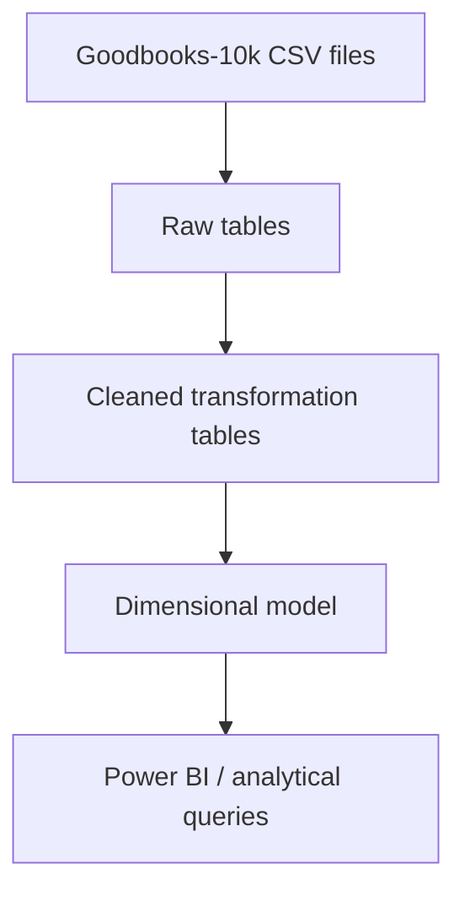

# Goodreads Data Warehouse: PostgreSQL & DuckDB

An end-to-end data engineering portfolio project that transforms the
[Goodbooks-10k dataset](https://github.com/zygmuntz/goodbooks-10k) from raw CSV
files into a Kimball-style dimensional model.

The project contains two independent SQL implementations:

- **DuckDB** for fast, local analytical processing.
- **PostgreSQL** as a relational backend, also tested on Microsoft Azure and
  used as the source for the Power BI report.

Both pipelines apply comparable data-quality rules and produce dimensions,
bridge tables, and fact tables for analytical queries.

## Project architecture



The dimensional layer is more precisely a **fact constellation** than a strict
single-star schema: the two fact tables share the books dimension, while bridge
tables resolve the many-to-many relationships between books, authors, and tags.

## Repository structure

```text
GOODREADS_DWH_FANIZZI2026/
├── data_visualization/
│   ├── dashboard_overview.png
│   ├── goodreads_datavisualization.pbix
│   ├── goodreads_fanizzi_datavisualization.pdf
│   └── popularity_vs_appreciation.png
├── duckdb/
│   ├── 01_paths_from_local_to_duckdb.sql
│   ├── 02_goodreads_duckdb_transformation.sql
│   ├── 03_goodreads_bridges_dimensions_facts_duckdb.sql
│   ├── goodreads_duckdb
│   └── goodreads_duckdb_exploration.sql
├── postgresql/
│   ├── 01_goodreads_dwh_transformation.sql
│   ├── 02_goodreads_dimensions_facts.sql
│   └── goodreads_query_exploration.sql
├── .gitignore
└── README.md
```

`duckdb/goodreads_duckdb` is the local DuckDB database file used by the project.
It can be recreated by running the SQL pipeline, so it does not need to be
treated as source code.

## Dataset

The source dataset contains 10,000 books and approximately six million raw
ratings. Download the following files from the
[original Goodbooks-10k repository](https://github.com/zygmuntz/goodbooks-10k):

- `books.csv`
- `ratings.csv`
- `book_tags.csv`
- `tags.csv`
- `to_read.csv`

Store all five CSV files in the same local folder. The folder can be located
anywhere on your computer; its absolute path is configured in the ingestion
script and must not be committed with a personal username or machine-specific
directory.

## Prerequisites

- [Git](https://git-scm.com/downloads)
- [DBeaver Community](https://dbeaver.io/download/)
- DuckDB support in DBeaver for the DuckDB pipeline
- A local or cloud PostgreSQL database for the PostgreSQL pipeline
- A web browser and a Power BI account to use Power BI Service
- [Power BI Desktop](https://www.microsoft.com/power-platform/products/power-bi/desktop)
  on a supported Windows system to open the included `.pbix` file (optional)

## Clone the repository

```bash
git clone <REPOSITORY_URL>
cd GOODREADS_DWH_FANIZZI2026
```

Replace `<REPOSITORY_URL>` with the URL of this GitHub repository.

## Option A: run the DuckDB pipeline in DBeaver

### 1. Create the DBeaver–DuckDB connection

1. Open DBeaver and select **Database > New Database Connection**.
2. Search for and select **DuckDB**.
3. In the **Path** field, select an existing DuckDB database file or choose
   where DBeaver should create a new persistent database file. For this project,
   you may select `duckdb/goodreads_duckdb`.
4. Select **Test Connection**. If DBeaver asks to download the DuckDB JDBC
   driver, accept the download.
5. Select **Finish**.
6. Right-click the DuckDB connection and open **SQL Editor > New SQL Script**.

See the official
[DuckDB guide for DBeaver](https://duckdb.org/docs/stable/guides/sql_editors/dbeaver)
for additional connection details.

> **Important:** the DuckDB database path selected in DBeaver and the folder
> containing the CSV files are two different paths. The first identifies the
> database file; the second is used by `read_csv_auto()` to locate the source
> data.

### 2. Configure the local CSV path

Open `duckdb/01_paths_from_local_to_duckdb.sql`. In every `read_csv_auto()`
query, replace `<YOUR_LOCAL_PATH>` with the absolute path of the folder that
contains the five CSV files. Keep each CSV filename unchanged.

Examples:

```sql
-- macOS
'/Users/your_username/Documents/goodbooks-10k/books.csv'

-- Windows: use forward slashes
'C:/Users/your_username/Documents/goodbooks-10k/books.csv'

-- Linux
'/home/your_username/goodbooks-10k/books.csv'
```

Do not commit a personal absolute path. The placeholder makes the script clear
and reusable without exposing a local username or tying the project to one
computer.

### 3. Execute the scripts in order

Run the numbered scripts against the same DuckDB connection:

1. `duckdb/01_paths_from_local_to_duckdb.sql` imports the raw CSV files.
2. `duckdb/02_goodreads_duckdb_transformation.sql` cleans, standardizes, and
   deduplicates the raw data.
3. `duckdb/03_goodreads_bridges_dimensions_facts_duckdb.sql` builds the final
   dimensions, bridge tables, and fact tables.

The optional `duckdb/goodreads_duckdb_exploration.sql` file contains the EDA and
data-quality queries that informed the transformation logic. Run it after raw
ingestion if you want to reproduce the analysis; it is not a required pipeline
step.

### Rerunning the DuckDB pipeline

The transformation and dimensional-model scripts drop and recreate their output
tables, so they support a reproducible **full-refresh** workflow. The current
ingestion script uses `CREATE TABLE`, however, and cannot recreate an existing
raw table. Before rerunning step 1 on the same database, either drop the five raw
tables or start with a new DuckDB database file.

## Option B: run the PostgreSQL pipeline in DBeaver

### 1. Create the PostgreSQL connection

1. Create or select a PostgreSQL database.
2. In DBeaver, select **Database > New Database Connection**.
3. Select **PostgreSQL** and enter the host, port, database, username, and
   password for your local or cloud instance.
4. Test and save the connection, then open a new SQL editor for it.

The project was developed with an Azure-hosted PostgreSQL database as the Power
BI backend, but the SQL model can also be run on a local PostgreSQL instance.
Azure credentials and connection strings are intentionally not stored in this
repository.

### 2. Load the source data correctly

Make the five raw tables available in PostgreSQL before building the final
dimensional model. Be aware that PostgreSQL `COPY FROM '/path/file.csv'` reads
from the **database server's filesystem**, not automatically from the computer
running DBeaver.

- For a local PostgreSQL server, `COPY` works when the server process can read
  the specified files.
- For Azure or another remote PostgreSQL server, use DBeaver's **Import Data / Data
  Transfer** feature or the client-side `psql` command `\copy`.

Do not put personal paths, passwords, Azure credentials, or connection strings
in committed SQL files.

### 3. Execute the scripts in order

1. `postgresql/01_goodreads_dwh_transformation.sql` prepares the cleaned
   transformation layer.
2. `postgresql/02_goodreads_dimensions_facts.sql` creates the dimensional model,
   including keys and relationships.

`postgresql/goodreads_query_exploration.sql` contains optional EDA and
data-quality checks. It can be run as soon as the raw PostgreSQL tables are
available and is not part of the required numbered execution sequence.

The PostgreSQL build uses a full-refresh strategy: existing transformation and
dimensional tables are dropped and recreated. When the DDL is wrapped in a
transaction, PostgreSQL can commit the complete rebuild as one unit or roll it
back if a statement fails.

## Transformation rules

| Source | Main rule |
|---|---|
| `books` | Trims text, replaces missing text with documented defaults, applies title fallback logic, and standardizes ISBN representations. |
| `book_tags` | Keeps one row per `(goodreads_book_id, tag_id)`, choosing the highest tag count with `ROW_NUMBER()`. |
| `ratings` | Keeps one row per `(user_id, book_id)`, choosing the highest rating when duplicates exist. |
| `tags` | Copies the tag reference data into the transformation layer. |
| `to_read` | Removes exact duplicate `(user_id, book_id)` pairs with `DISTINCT`. |

DuckDB uses `QUALIFY` to filter the output of `ROW_NUMBER()` directly. The
equivalent PostgreSQL implementation normally calculates the window function in
a CTE or subquery and filters it in the outer query.

The highest-rating rule is an explicit conflict-resolution assumption because
the source data does not provide a reliable rating timestamp. It may bias
results upward and should be reconsidered if a trustworthy event timestamp
becomes available.

## Dimensional model

| Object | Grain or purpose |
|---|---|
| `dim_books` | One row per book. |
| `dim_authors` | One row per author extracted from the source authors field. |
| `dim_tags` | One row per Goodreads tag. |
| `bridge_book_authors` | One row per book–author relationship. |
| `bridge_book_tags` | One row per book–tag relationship, including the tag count. |
| `fact_ratings` | One retained rating per user–book pair. |
| `fact_to_read` | One user–book “to read” event; a factless fact table. |

The two fact tables are kept separate because they describe different business
processes and grains. `fact_ratings` contains a numeric measure, while
`fact_to_read` records the existence of an intent. Combining them would add
nullable measures and make aggregations less clear.

Bridge tables prevent book-level facts from being duplicated when users filter
or group results by authors or tags.

## Key engineering decisions

- **Dual implementation:** the same analytical problem is implemented in a
  local columnar OLAP engine and a relational database.
- **Full-refresh builds:** downstream tables are dropped and recreated to make
  development runs predictable.
- **Explicit grains:** facts and bridges have documented row-level meanings.
- **Missing values:** text defaults such as `unknown` and the numeric sentinel
  `-1` are documented; consumers must treat `-1` as an unknown year, not a real
  publication year.
- **Deduplication:** window functions apply deterministic business rules to
  duplicate business keys.
- **Many-to-many modeling:** author and tag relationships are represented by
  bridges instead of duplicating rating facts.
- **BI separation:** Power BI reads the PostgreSQL dimensional layer; DuckDB is
  an independent local analytical implementation.

## Data visualization and business insights

The PostgreSQL pipeline was managed from macOS through DBeaver, and its
Azure-hosted dimensional model was used as the dashboard data source. The report
was created with **Power BI Service (the online version)** because Power BI
Desktop could not be installed on the macOS Monterey computer used for this
project.

This choice made it possible to build and publish the visualization from a web
browser while keeping PostgreSQL as the analytical backend. To reproduce the
report, connect Power BI Service to your own populated PostgreSQL instance and
update the data-source settings. Depending on where PostgreSQL is hosted, the
connection may require a supported data gateway.

### Dashboard overview


The overview presents the dataset scale, overall rating metrics, and the authors
with the highest average ratings in the current report. The dashboard reports an
overall average rating of approximately 3.92 and places Bill Watterson among the
highest-rated authors.

### Popularity versus appreciation


This view compares rating volume with average rating. It shows that the books
with the greatest engagement are not necessarily the books with the highest
average scores. For example, *The Hunger Games* has very high rating volume but
does not have the highest average rating among the displayed titles.

### Dashboard files

- [Interactive Power BI file](data_visualization/goodreads_datavisualization.pbix)
- [Static dashboard export](data_visualization/goodreads_fanizzi_datavisualization.pdf)

## Technologies

- **Databases:** PostgreSQL, DuckDB
- **Cloud:** Microsoft Azure Database for PostgreSQL
- **Language:** SQL
- **Tools:** DBeaver, Power BI, Git
- **Modeling:** Kimball-style dimensional modeling, fact constellation, bridge
  tables, transaction fact, and factless fact


## Project purpose

This project demonstrates the ability to explore raw data, document data-quality
assumptions, implement SQL transformations in two database engines, design an
analytical dimensional model, deploy a cloud database, and expose curated data
through a Power BI report.

## Attribution

Dataset: [Goodbooks-10k by zygmuntz](https://github.com/zygmuntz/goodbooks-10k).
Refer to the source repository for its original documentation and usage terms.
